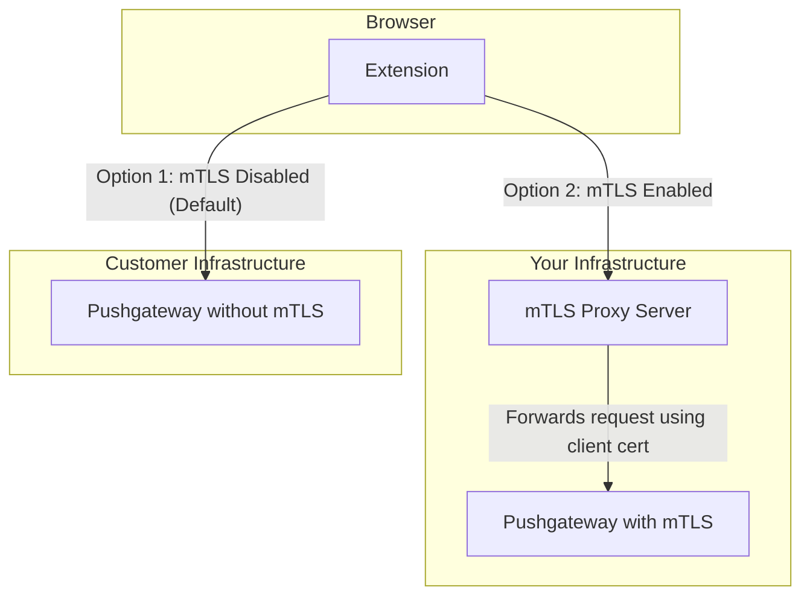

# Optional mTLS Implementation Plan

This document outlines how to add optional mutual TLS (mTLS) support to the WebRTC Stats Exporter by introducing a proxy server. Customers who require mTLS can route traffic through the proxy, while others continue to send metrics directly to their Pushgateway.

## Architecture

## Implementation Steps

1. **Create the Proxy Server**
   - Example implementation is provided in `proxy-server.js`.
   - Proxy authenticates requests using an API key and forwards them with client certificates.
2. **Update the Extension**
   - Add options to enable the proxy, specify the proxy URL and API key.
   - Modify the Pushgateway client logic to send requests via the proxy when enabled.
3. **Onboard Customers**
   - Use `onboard_customer.sh` to generate API keys and client certificates.
   - The script updates `proxy-config.js` and reloads the proxy service.
4. **Documentation**
   - This directory contains all necessary scripts and code samples.
   - Adjust paths and deployment details to match your environment.
